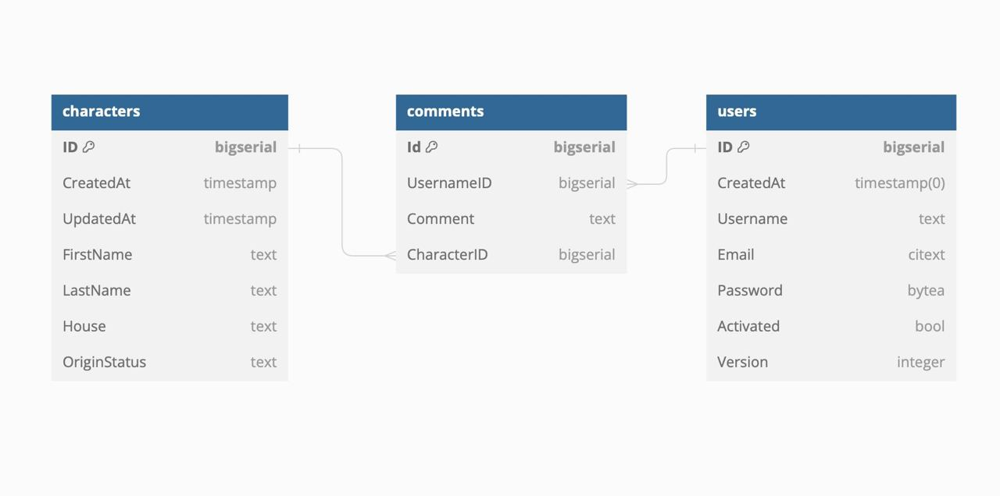

# Harry Potter API
This API about characters from Harry Potter universe

## Student's info
Aisha Abilmazhinova 22B030280

## DB structure


```
Table characters {
  ID bigserial [primary key]
  CreatedAt timestamp
  UpdatedAt timestamp
  FirstName text
  LastName text
  House text
  OriginStatus text
}

Table users {
  ID bigserial [primary key]
  CreatedAt timestamp(0) 
  Username text 
  Email citext 
  Password bytea
  Activated bool 
  Version integer 
}

Table comments {
  Id bigserial [primary key]
  UsernameID bigserial 
  Comment text
  CharacterID bigserial 
}

Ref: characters.ID< comments.CharacterID

Ref: users.ID< comments.UsernameID
```
## API structure

### Endpoints

#### Characters

| Метод | URL | Описание |
|---|---|---|
| POST | /api/v1/character | Создание нового персонажа. |
| GET | /api/v1/character/{ID} | Получить персонажа по ID. |
| PUT | /api/v1/character/{ID} | Обновить персонажа по ID. |
| DELETE | /api/v1/characters/{ID} | Удалить персонажа по ID. |
| GET | /api/v1/charactersfilter | Фильтровать персонажей по факультету. |
| GET | /api/v1/characterssorting | Сортировать персонажей по фамилии. |
| GET | /api/v1/characterspagination | Вывести данные с определенным лимитом. |

#### Users

| Метод | URL | Описание |
|---|---|---|
| POST | /api/v1/users | Регистрация нового пользователя. |
| PUT | /api/v1/users/activated |Активация пользователя. |
| POST | /api/v1/users/login | Логин пользователя. |

#### Comments

| Метод | URL | Описание |
|---|---|---|
| POST | /api/v1/comments | Создание нового комментария. |
| GET | /api/v1/comments/{ID} | Получить комментарий по ID. |
| PUT | /api/v1/comments/{ID}| Обновить комментарий по ID. |
| DELETE | /api/v1/comments/{ID} | Удалить комментарий по ID. |
| GET | /api/v1/commentsfilter | Фильтровать комментарии по userID. |
| GET | /api/v1/commentssorting | Сортировать комментарии по characterID. |
| GET | /api/v1/commentspagination | Вывести данные с определенным лимитом. |

#### Relation between Entities
| Метод | URL | Описание |
|---|---|---|
| GET | /api/v1/character/{ID}/comments | Вывод комментариев по characterID. |
| GET | /api/v1/users/{ID}/comments |Вывод комментариев по userID. |

