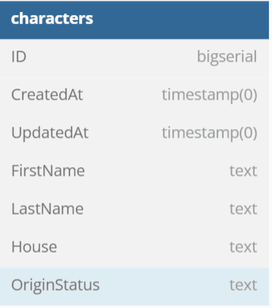

# Harry Potter API
This API about characters from Harry Potter universe

## DB structure


```
Table characters {
  ID        bigserial 
  CreatedAt timestamp(0) 
  UpdatedAt timestamp(0) 
  FirstName text 
  LastName text
  House text 
  OriginStatus text 
}
```
## API structure

### Endpoints

#### Characters

| Метод | URL | Описание |
|---|---|---|
| POST | /api/v1/character | Регистрация нового персонажа. |
| GET | /api/v1/characters/{ID} | Получить персонажа по ID. |
| PUT | /api/v1/characters/{ID} | Обновить персонажа по ID. |
| DELETE | /api/v1/characters/{ID} | Удалить персонажа по ID. |
